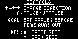

# Nielk
The classic snake played on the surface of a Klein bottle. A game made for the [Arduboy](https://arduboy.com).
## Screenshots
  

## Quick Start
If you have an Arduboy, check out the Arduboy [Quick Start Guide](https://community.arduboy.com/t/quick-start-guide/2790) to get started. With the Arduino IDE you can compile `nielk.ino` and upload it to your Arduboy.

Otherwise, you can use an enumulator like [Sim-Arduboy](https://github.com/dxxb/sim-arduboy) to play the already compiled binary `nielk.hex`.
## Image Tools

## Resources
