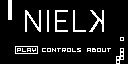

# Nielk
The classic snake played on the surface of a Klein bottle. A game made for the [Arduboy](https://arduboy.com).
## Screenshots
  

## Playing the Game
If you have an Arduboy, check out the Arduboy [Quick Start Guide](https://community.arduboy.com/t/quick-start-guide/2790) to get started. With the Arduino IDE you can compile `nielk.ino` and upload it to your Arduboy.

Otherwise, you can use an enumulator like [Sim-Arduboy](https://github.com/dxxb/sim-arduboy) to play the already compiled binary `nielk.hex`.

## Image Tools and Screenshots
While developing this small game, I wrote two Python scripts to help me, which are both available at [ard-img-tools](). The first, `ard_img_to_bitmap.py`, converts images to bitmaps (or arrays of bitmaps in the case of multiple frames). I used this to convert the background images as well as the numbers for the timer and score. 

The second, `ard_screenshot.py`, listens to a given serial port for screenshots sent from the Arduboy. I used it to take screenshots, especially of the final frame of the game after you have lost.

## Resources
 - [The Arduboy Community Forum](https://community.arduboy.com)
 - [How to Screenshot Your Game](https://community.arduboy.com/t/screen-mirroring-guide-how-to-screenshot-your-game/2800)
 - [Arduboy2 Library](https://mlxxxp.github.io/documents/Arduino/libraries/Arduboy2/Doxygen/html/index.html)
 
